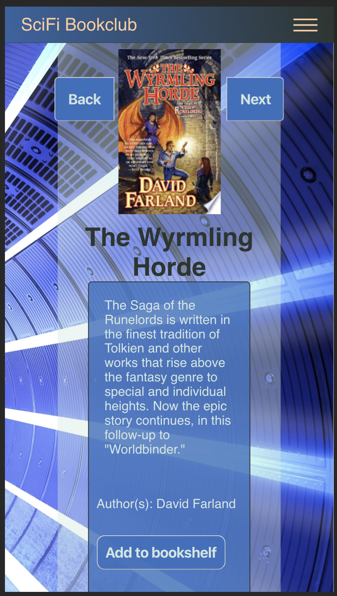

# SciFi Bookclub
### Link to the App hosted on Zeit.co
[https://capstone-scifibookclub-client.mascontris.now.sh/](https://capstone-scifibookclub-client.mascontris.now.sh/ "SciFi Bookclub App")

## Browse a selection of science fiction books hosted on Google Books API.
see a list of the top science fiction books by popular authors.

### Read descriptions of books
You can review the descriptions of books you are interested in.

### Add books to your own bookshelf
Select books that you find interesting and add them to your personal bookshelf for future review.

## Technology used
HTML, CSS, Javascript, JSX, REACT, Node.js, PostgreSQL, Express

